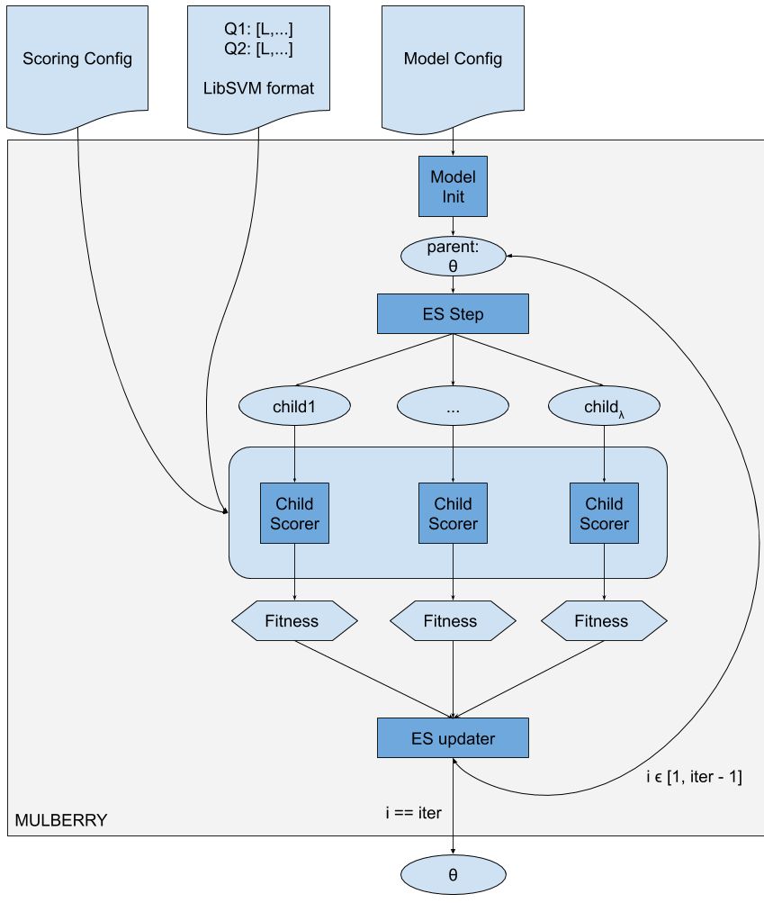

# Evokit

An Evolutionary Strategies Toolkit for high speed blackbox optimization.  Evokit currently supports Classic ES (p, λ), Natural Evolutionary Strategies, and Canonical Evolutionary Strategies optimization.  It requires a processor supporting AVX operations.

This toolkit has two binaries:
1) `evo-rank`: an out of the box ES ranker similar to the papers listed below
2) `mulberry`: a framework that supports custom optimization goals, including market level metrics. As most of our work is focused on this framework, the readme outlines this.

## Table of Contents
1. [Development](#development)
2. [Mulberry High Level View](#mulberry-high-level-view)
3. [Opening the blackbox](#opening-the-blackbox)
4. [Using the framework](#using-the-framework)
5. [Relevant Papers](#relevant-papers)

## Development
Please see [docs/DEVELOPMENT.md](docs/DEVELOPMENT.md) for how to run this code locally and edit the code in this repo.

## Mulberry High Level View

In the above flowchart you can see a high level view of how Mulberry learns a new model.

A user must provide:
1) Scoring & policy config: specifies what metrics to optimize for and how to weight each metric in the final fitness function computation. These weights are hyperparameters and must be provided by the user. They are NOT learned by the framework. Please see the [tuning section](docs/TUNING.md) for suggestions on how to select these values.
2) train/validation data: provide separate train and validation data in LibSVM format
3) model & optimizer config: currently passed as separate arguments at train time

## Opening the blackbox
For a more detailed view on each component of Mulberry, please see [docs/MULBERRY.md](docs/MULBERRY.md). You can also see more information in the cargo docs.

## Using the framework
To build your own pipeline using Mulberry, please see [docs/BUILDING_PIPELINE.md](docs/BUILDING_PIPELINE.md).

## Relevant Papers
### Relevant Papers
- [Paper on Evokit/Mulberry](https://arxiv.org/abs/1905.06452)
- [ES-Rank: Evolution Strategy Learning to Rank Approach](http://www.cs.nott.ac.uk/~pszjds/research/files/dls_sac2017.pdf)
- [An Evolutionary Strategy with Machine Learning for Learning to Rank in Information Retrieval](https://www.researchgate.net/publication/321823857_An_Evolutionary_Strategy_with_Machine_Learning_for_Learning_to_Rank_in_Information_Retrieval)
- [Back to Basics: Benchmarking Canonical Evolution Strategies for Playing Atari](https://arxiv.org/abs/1802.08842)
- [Natural Evolution Strategies](http://www.jmlr.org/papers/volume15/wierstra14a/wierstra14a.pdf)
- [Evolution Strategies as a Scalable Alternative to Reinforcement Learning](https://arxiv.org/abs/1703.03864)
- [From Complexity to Simplicity: Adaptive ES-Active Subspaces for Blackbox Optimization](https://arxiv.org/abs/1903.04268)
- [Limited Evaluation Cooperative Co-evolutionary Differential Evolution for Large-scale Neuroevolution](https://arxiv.org/abs/1804.07234)
