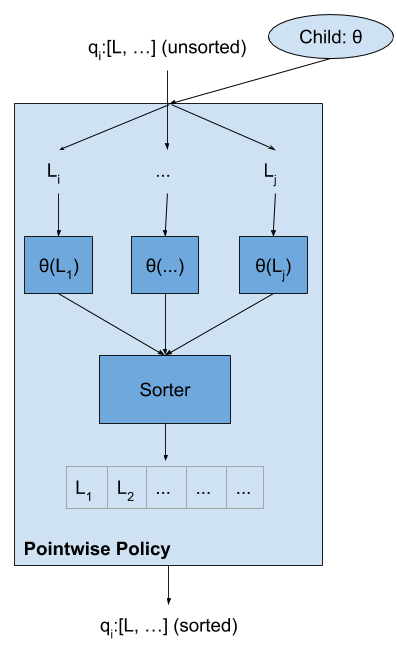
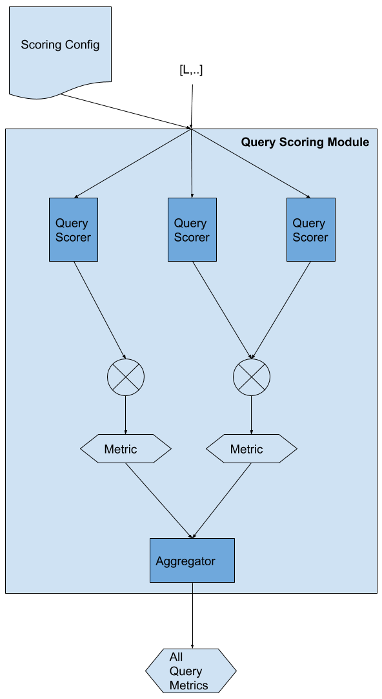

# Mulberry

<!--
TODO: should the parts that apply to evo-rank be moved to a separate file?
-->

## Table of Contents
1. [Optimizers](#optimizers)
2. [Model Types](#model-types)
3. [Policies](#policies)
4. [Computing the fitness of a child](#computing-the-fitness-of-a-child-)

## Optimizers

Mulberry offers a selection of optimizers for maximizing the scoring criteria specified by a user.  As many of the objectives fail to offer differentiable or continuous derivatives, we use two main classes of gradient-free optimization: Evolutionary Strategies and Differential Evolution.  Below we attempt describe how different optimizers work.

### Evolutionary Strategies

Evolutionary Strategies is a class of gradient-free optimizers that estimate the gradient of a policy/model, parameterized by Θ, with respect to a user-specified objective function (also called Fitness function), F, by exploring a sampling of slightly perturbed variants.  The different flavors of ES provided trade-off between computational efficiency, robustness to stochastic policies, and linearity of the models.

In nomenclature, the "parent" is considered the current policy.  "Children", "Candidates" or "Search Gradients" are terms referencing the parent policy perturbed by some noise distrubtion and used in constructing the gradient estimate.

Mulberry offers three variations of the base Evolutionary Strategies:
- Classic/Simple Evolutionary Strategies (p, λ)
- Natural Evolutionary Strategies (NES)
- Canonical Evolutionary Strategies

#### Simple Evolutionary Strategies, or (1+1)-ES

In this formulation, Mulberry will evaluate a single candidate and evaluate its Fitness function.  If the candidate fitness is better than the parent Fitness, Θ is updated to use the candidate parameters.  Otherwise, the parent remains unchanged.

This is in effect stochastic hill climbing: we randomly generate a search gradient in close proximity to the current policy (ε_i ~ N(0, 1); Θ_i = Θ + ε_i) and if it's better than the existing policy, replace it.  While simple, it turns out to be surprisingly effective with linear models on large datasets.

#### Simplified Natural Evolutionary Strategies (1+λ)-ES

Natural Evolutionary Strategies, or NES, constructs a gradient using λ different candidates at each optimization step.  Candidates are generated by perturbing the parent policy with a noise distribution and the scores evaluated using the fitness function:

    ε_k ~ Ν(0, C)
    Θ_k = Θ + ε_k
    score_k = F(Θ_k)

As in the Salimans et al. paper, we simplify away the covariance matrix C from the perturbation distribution by instead sampling from an Isotropic Gaussian.  Subsequently, we can rewrite our gradient estimate as a weighting of sampled policies by their resulting fitness scores:

In the above, σ represents the relative variance of the local search space.  As in Salimans et al., we set σ=1 as empirical evidence indicates the optimization is insensitive to values of sigma.
 
We update our parameters Θ via standard Gradient Ascent: Θ_(i+1) = Θ_i + α⋅∇Θ_i., where α is user specified learning rate, typically also set to 1.

Mulberry optionally offer two additional features: Fitness Shaping and Momentum.  Fitness Shaping constructs the gradients by using a rank transform on the actual fitness scores: 

This transform retains the rank importance of the underly search gradients by assign fixed weights based on sorted position.  As discussed by Wiestra et al. and Salimans et al., the rank transform suppresses the impact of outliers on the gradient estimation, allowing it to escape early local maxima.  While especially effective with stochastic fitness functions, it can have a slightly negative impact in deterministic fitness functions, thus is optional.

Natural Evolutionary Strategies attempts to estimate the natural gradient wrt F and updates the policy using standard gradient descent.  This framing allows for the use of the broad field of second-order derivative estimators, such as Momentum, to accelerate gradient steps.  Currently, Mulberry only implements standard Momentum with a user provided γ.

#### Canonical Evolutionary Strategies (1+λ/K)-ES

Canonical ES estimates the gradient by using the top K search gradients as sorted by fitness.  Because it only uses the best candidates to estimate the ∇Θ, it often converges faster than NES to a good policy but lacks the fine tuning advantage.

<!--
### ES Step
Generate children by sampling steps from the normal distribution.
### ES Updater
After computing the fitness scores for all the children, we determine whether the new candidate or the old parent should “survive”.
-->
### Differential Evolution (Coming!)

## Model Types
We support using different models.
- Linear
- Fully connected neural network
- Trees (Coming!)

## Policies
Policies define how to get a ranked list of documents for a query (using the underlying model). In the case of classification, we simply output the score from the underlying model.
### Pointwise

For pointwise policy, we score each document separately, then sort the documents based on the score. For classification, we just return the model's score.
### Beam

For beam, we treat the possibilities of ranked lists as a graph and explore the most promising nodes (with a limiting bound: b). This uses breadth-first search. At each level we generate all the candidates for the current leaf nodes, then sort those candidates by the model score (our heuristic) and keep the top b candidates. Only those top candidates are expanded next.

You will need to set the number of candidates to explore.
#### Aggregators
We use aggregators to capture the previous documents selected. Every time a document is selected, we update the aggregator's state with the new document. Right now we default to a mean aggregator, but we also support:
- Counts
- Total sum
- Mean
- Variance
- EMA

### Stochastic Policies

### Last Pass
In addition to the underlying policies we also support a last pass intervention both at training and evaluation time. We support:
- Boosting: boost candidates from a certain type to the top of a ranked list. E.g. This can be used to recreate the effects of the buyer promise intervention

## Computing the fitness of a child (λ)
For each child (model weights), we compute its fitness by scoring and ranking all the documents. The final fitness is a weighted combination of different market level indicators.

### Query-level Scoring Module

Given a sorted list of documents for a query, compute the score for that query. Possible metrics to compute could include:
- NDCG
- Avg Price@K
- Is the top document free shipping
- grouped-AUC
- Profit@K

We mainly use a 1-1 mapping of Query Scorer to Metric, but you can aggregate the Query Scorers before computing the Market level Indicators.

For a full list of possible scorers, please see:

TODO: link to cargo docs

### Market-level Scoring Module

After computing the query level metrics, we can filter and get subsets of queries, then compute market level metrics. For example, we can compute:
- Avg free shipping rate across all queries
- Avg free shipping rate across purchase queries
- Median price in the first position across all queries

We support a few different Market-level indicators:
- Mean
- Histogram
- Chi-Squared
- Gini
- AUC
