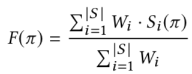

# Tuning

## Types of hyperparameters
- Model hyperparameters:
    - Type of model
    - Number of layer
    - Size of each layer
- Optimizer hyperparameters:
    - Number of children (lambda)
    - Number of iterations
    - Whether to always update
- Fitness function hyperparameters:
    - Optimization goals
    - Importance weights for each goal
- Policy hyperparameters:
    - Type of policy
    - Number of candidates to search

While it's definitely worth tuning the model, optimizer and policy hyperparameters, this doc focuses on understanding and tuning the fitness function weights.

## Importance Weights
As mentioned in the Mulberry docs, the final fitness of a candidate is a weighted combination of the market level indicators. However, these weights are hyperparameters that must be provided before training and aren't learned in the process. This is because they define what the goal is, adjusting the trade-off between different objectives.

These are the `W_i` defined in the function above for computing fitness, where `S_i` is a market level indicator.

### Pareto Frontier

## Number of children
As you increase the model complexity or feature set size, you should explore variants using larger values for lambda.

## FAQ
### Is there a way to run hyperparameter tuning automatically?
Although we haven't explored it, you may be able to use dresden's hyperparameter search.
TODO: I'm also curious about aspects of the modeling approach (like what we were talking about above, intuition for messing with HPs)
